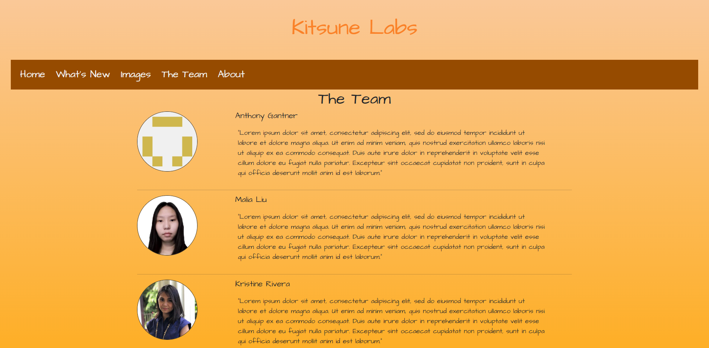

## What is a UI Framework?

UI Frameworks are essentially a toolkit that can be used by a web developer who knows of it in order to more easily make a website. While there is a learning curve from
what I have experienced so far working with Bootstrap 5, I can say that it makes many tasks easier, but also make some things harder to grasp. 

## UI vs Raw HTML

I found that using bootstrap made many tasks easier, but it also somewhat pushed me into relying on it extensively rather than trying to figure out how to make it work without it.
Additionally, I found that some tasks were made extremely hard to do as I could not easily find documentation on it. An example of this is working with dropdown menus in Bootstrap.
By default, the dropdown menus present in bootstrap 5 requires one to click them to activate them. While it is possible to change this through the css, I found it incredibly hard to do so
as I could not find a easy way to do it. Additionally, there were times where I grew increasingly frustrated with working with images in bootstrap as I could not figure out how to make elements overlap
one another and even after hours could not figure it out. 

## Using Bootstrap

Though at times I found it frustrating to use, I cannot play down the benefits of using bootstrap. It made formatting webpages easier, made it much easier to make a navigation bar,
made aligning images a breeze aswell as made many tasks easier. Actually having learned it made it possible for me to make a website for another class that I am taking this semester.

In that image, if it were not for having learnt bootstrap, I do not believe it would have been possible for me to properly format all the passages and images in as little a time as it did with bootstrap. 

## Final Thoughs

While I believe there are many uses for UI Frameworks and I have learned about how powerful they can be, I do find that it can sometimes be painful to work with when you do not fully understand it. While raw html and raw css gives you very minute control over all the variables, I find that to sometimes be tiresome. Thus I can only really call UI frameworks a web development shortcut that requires a bit of learning before being able to implement it to a moderate degree and a lot of training to master. 
