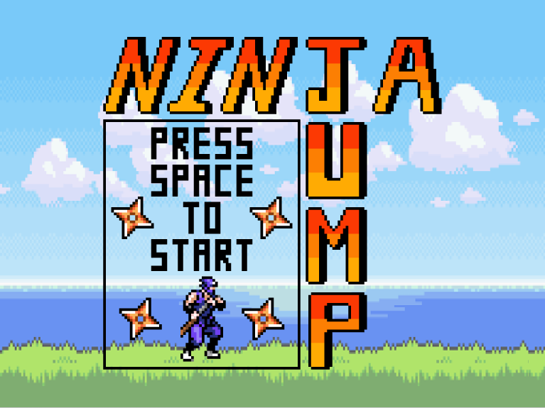

  

Ninja jump was a game made by Patima Poochai, Alex Jones, and me in 2018 during our semester taking ICS 111 with Jason Leigh. The game was heavily inspired by the game doodle jump, a mobile game in which you control a bug like creature and shoot upwards at enemies while perpetually bouncing on various platforms. 

<h2 id="Gameplay">Gameplay</h2>

In our version of the game, you play a ninja who jumps up from one cloud to the next all while ninja stars try to strike you down and the gaps between clouds try to plummet you to your doom. The game itself was controlled by the arrow keys and let you move left and right all while the ninja character would continue bouncing on the platforms that it landed on. 

<h2 id="Development">Development</h2>

To develop this game, Alex, Patima and I all put our heads together to think of a game that would be small enough to be achievable with our limited coding knowledge which resulted in us coming up with the idea to essentially make our own version of doodle jump. In the development of the game, Patima and Alex did the bulk of the coding while I was securing assets, cleaning them up, and at the end, bug hunting and fixing any that I could find. 

<h2 id="What I Learned">What I Learned</h2>

In the course of developing this project, I was able to improve my teamwork skills aswell as learn about editting images with GIMP aswell as learning more about the Java coding language.

Source: <a href="https://github.com/patimapoochai/Project3"><i class="large github icon "></i>patimapoochai/Project3</a>
