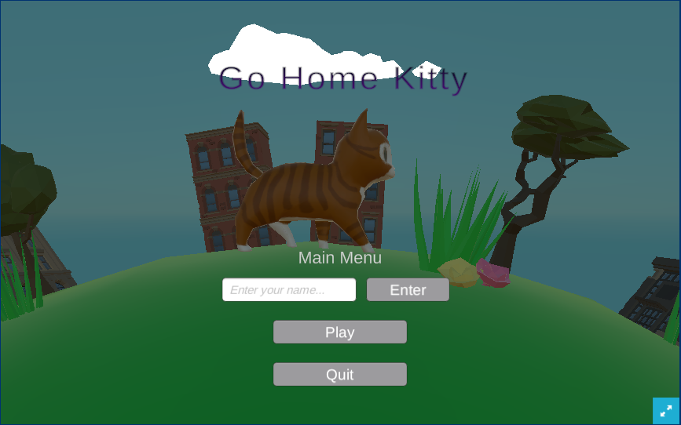

  

<h2 id="The Gameplay">The Gameplay</h2>

The game follows a cat who's owner has abandoned them at a store. In order to get home to your owner, you are tasked with finding various keys first inside the store, and then in the city in order to finally make it home
to your owner. The keys are hidden around the map and only by obtaining all of them can you go home. 

<h2 id="Current Progress">Current Progress</h2>

The game has been fully created and can be found on 
https://kitsune-laboritories.github.io/Evil-Incarnate.github.io/

<h2 id="What I'm Learning">What I'm Learning</h2>

I am learning about using trello, unity and also how to work together in a large group. 

<h2 id="My Contributions">My contributions</h2>

I mainly worked on the character and camera controls for the character, having gone through multiple iterations in order to make it so that the camera for the most part would smoothly follow the character without colliding into walls and when they do, do no quickly jerk around causing discomfort to the user. Additionally, I implemented a way for the player to control the camera by right click dragging the camera. 
