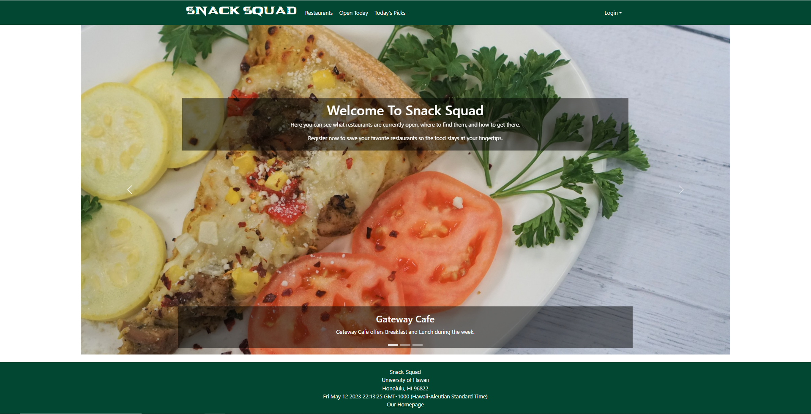

  

<h2 id="What Is It?">What Is It?</h2>

Snack Squad is an implementation of the Manoa Munchies final project for ICS 314 which aims to give the end user a overview of what there is to eat at UH Manoa. In our implementation, we strived to make it so that a user would be able to favorite certain food items or restaurants that they found particularly appealing so that they could go back and see what it is that they had favored. Additionally, we tried to add various functionality such as searching and a way to hide stores that were closed at the time the user was accessing the site. 

<h2 id="What I Learned">What I Learned</h2>

Throughout creating the site, I grew much more familiar with both uniforms and bootstrap along with learning more about CSS. Due to what it was that I worked on, I did not delve too deeply into any of these topics in particular, but I was able to gain some general knowledge into many bootstrap utilities as well as learn a lot about uniforms' capabilities.

<h2 id="My Contributions">My Contributions</h2>

Source: <a href="https://github.com/snack-squad/snack-squad.github.io"><i class="large GitHub icon "></i>https://snack-squad.github.io</a>
